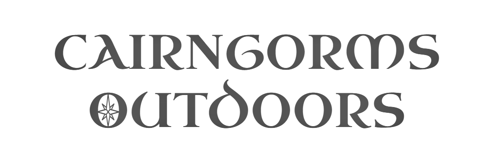
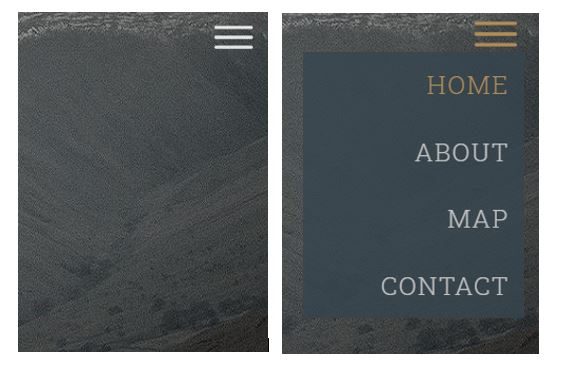
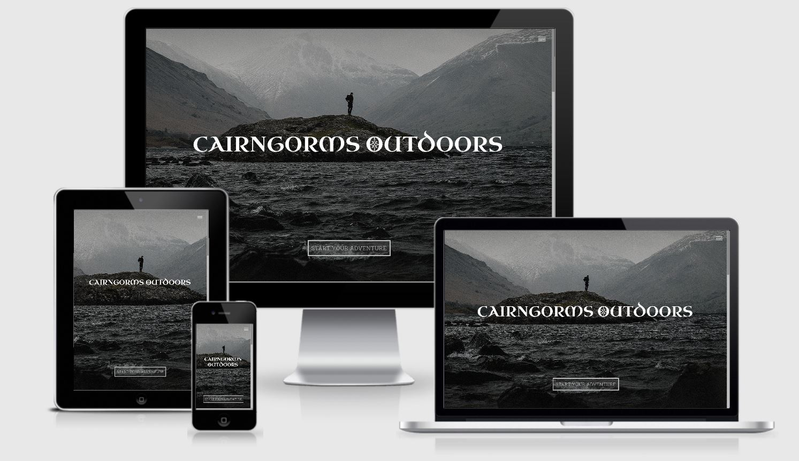
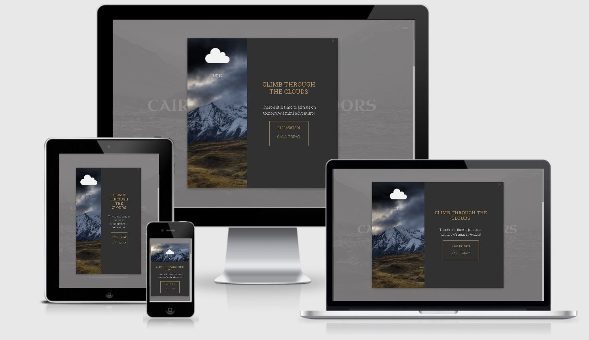
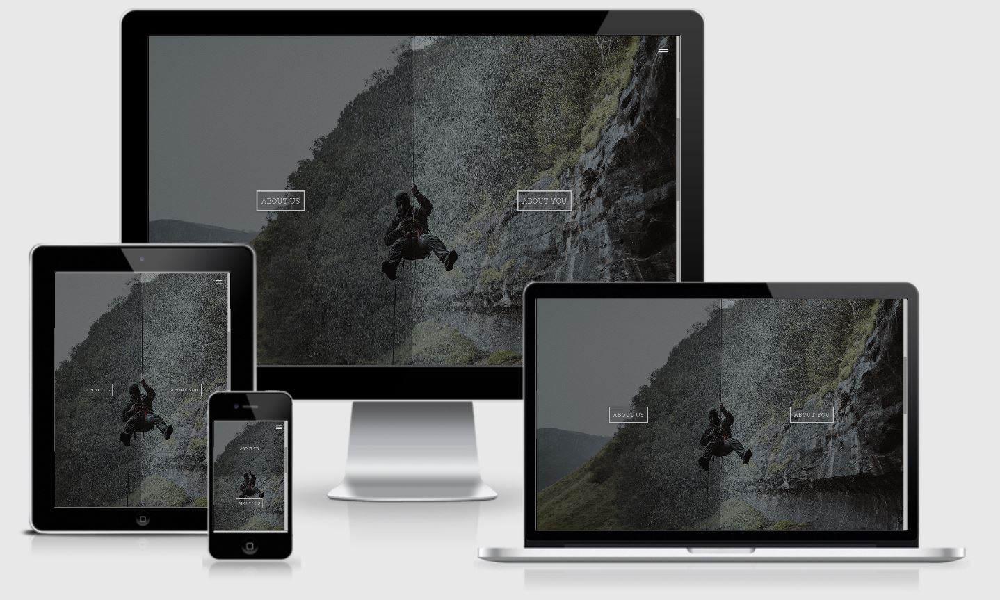

# Interactive Frontend Development Milestone Project
This project provides an interactive website for potential customers of an outdoor expedition company. User inputs to a series of questions populate a 3D map with a route, markers, photos, gifs and text with the goal of giving users an insight into what their expedition would be like. Using a little form-ception, the same user inputs are used to populate the values in a contact form, so if the user likes what they see, it's easier for them to get in touch.

## UX
### Users
Visitors to the website are likely to be potential customers. They might want to plan an expedition in the future, or they may be looking for something on very short notice. They might be an individial, or the might be part of a group of friends, or even looking for a team building exercise for a school or corporate group. 

These users will need to be able to find out a bit more about the company, see what an expedition with them would be like, and have a way to get in touch with the company. To design the website to meet these needs, the four potential user stories set out below have been followed. 

### User Stories

1. As an individiaul who loves going walking outdoors, I want to explore Scotland. I'd like to have a good idea of what the expedition will be like, especially as I'm not a fan of water. I'd like to get in touch with the company by email first, just to ask them some questions. 
2. As a high school teacher, I want to plan an end of term camping trip for our class. I want to be able to show the kids what it will be like, so they can all get really excited. The kids are all over social media, so it would be great if they could check it out before hand and post their photos there after.  
3. As a company manager in charge of booking this years team building, I want to organise something a bit different. It'd be great if I could show them what it will be like, so they know it won't be a let down like last year. 
4. As a group of friends looking for something to do tomorrow, we want to organise something straight away. We'd rather get in touch by phone than wait for an email response, so we know that it's all sorted. 

### Resulting Goals 
Based on these four user stories set out above, there are five main goals for this project: 
- Provide a way to display a potential expedition to users 
- Provide tailored options for individuals and different types of groups 
- Quickly provide the user with a telephone number for the company 
- Provide a way for users to get in touch with the company via email
- Provide links to the companies social media accounts

### Wireframes and Flowchart
##### Wireframes
These wireframes were sketched at the start of the design process: 
- [Home Section](readme-assets/pdf/home-sketch.pdf)
- [About Section](readme-assets/pdf/about-sketch.pdf)
- [Map Section](readme-assets/pdf/map-sketch.pdf)
- [Contact Section](readme-assets/pdf/contact-sketch.pdf)

Based on the preliminary sketches above, three sets of wireframes were created using [Balsamiq Wireframes](https://balsamiq.com/wireframes/). 
- [Phone](readme-assets/pdf/Phone.pdf)
- [Tablet](readme-assets/pdf/Tablet.pdf)
- [Laptop/Desktop](readme-assets/pdf/Desktop.pdf)

##### Flowchart
This flowchart visualises the path a user takes through the "About You" form questions.
- [Flowchart](readme-assets/pdf/AboutYouFlowchart.pdf)

This flowchart is useful when looking at the jquery that manipluates the user's path through the questions. 

## Design Choices
### Colours 

The colour palette consists of four colours: charcoal grey `#454545`, metallic gold `#b08d57`, metallic silver `#c0c0c0` and a metallic green `#7c9d8e`. These colours provide contrast to each other without dazzling the user with bright neon colours and they complement the colours of the images displayed across the webpage. They allow for noticable and consistent hover effects on elements across the webpage. 

### Icons 
Icons are used throughout to provide a break from text infomration, and to quickly give feedback to the user. For example, a green checkmark or a red cross quickly give feedback to the user about the success/error status of submitting their contact form. Icons have also been used in place of text where they will be automatically recognised by the user, i.e. social media icons in the footer will almost always be automatically be recognised by the user as clickable links to social media accounts. 

This project uses icons provided by [fontawesome](https://fontawesome.com/) and [ionicons](https://ionicons.com/). To keep consistency throughout the webpage, the svg files for the icons used for the custom [map markers](###markers) I have made are also from [fontawesome](https://fontawesome.com/). 

### Fonts
The company logo is formatted in Uncial Antiqua font to provide a Celtic feel upon landing on the page. 

There is a minimal amount of text content presented on the website. All of it is presented in Roboto Slab font, with different weightings and spacings applied throughout. This font was chosen because it is complimentary to Uncial Antqiua and is easy to read even on smaller screen sizes. This font has been imported using [Google Fonts](https://fonts.google.com/). 

## Features
### Existing Features 
#### Navigation

- Navigation is provided by a nav toggle icon in the top right corner. On click, this icon toggles between expanding and collapsing a navigation menu. This icon is fixed in place regardless of a users location on the webpage, providing consistency for the user. 
- On hover, items listed in the navigation menu turn gold. On click, they take the user to that section of the webpage.
- [Scrollsnap](https://css-tricks.com/practical-css-scroll-snapping/) is used to allow users to navigate through the webpage one section at a time. This also means that the user can navige through the webpage sections using keyboard controls (`up`, `down`, `enter`). 
- Using [jQuery](https://jquery.com/), the nav toggle icon changes colour to a dark charcoal colour when it is located over the map section. This provides contrast to the map colours so that it remains visible to the user. On scrolling beyond the map section, the nav toggle icon reverts to a silver colour. 

#### Home


- The user is presented with a dramatic fullscreen background image and the company logo.
- On small screens the company logo is split into two lines. On larger screens, it occupies only one line. On small screens which are rotated to a landscape view, the company logo also occupies only one line. 
- A call to action button prompts the user to "Start Your Adventure". On hover, this button turns gold. On click, this button is animated with a gold wave effect and takes the user to the next section of the page. 
- The logo, nav toggle icon and call to action button are animated to fade into visibility. The logo becomes visible first, then the nav toggle icon and call to action button. Not all [jQuery Effects](https://api.jquery.com/category/effects/) were functional on my own device, so elements have been animated with [MDBootstrap Animations](https://mdbootstrap.com/docs/jquery/css/animations/) instead. 

#### Modal


- The modal prompts the user to contact the company by phone if they want to join them on their expedition the following day. This allows users who are looking for an expedition on short notice to get in touch and organise one, without the delay of filling in a contact form and waiting for a response. 
- The modal content is determined by the current weather in the Cairngorms, retrieved from calling weather data from Aviemore from  [OpenWeather's Weather API](https://openweathermap.org/api). This live weather data is used to set a corresponding gif background image, weather icon and text for the modal.
- The weather icon is provided by [OpenWeather's Weather Icons](https://openweathermap.org/weather-conditions).  The src url for the icon is constructed by passing the weather icon code returned by the API call into a variable holding the URL template: 

    ```let weatherIconURL =  `https://openweathermap.org/img/wn/${weatherIconCode}@2x.png`;  ```
- The gifs are sourced by using the gif link from [GIPHY](https://giphy.com/). 
- [`setTimeout()`](https://www.w3schools.com/jsref/met_win_settimeout.asp) is used to delay the modal appearing until the user has been on the webpage for 15 seconds. 
- The modal maintains the same colour scheme as the rest of the site. It can be closed using the gold cross icon that appears in the top-right corner. 

### About


- This section is split into two equally sized panels. On xs-size devices, the section is split horizontally, with one panel occupying the top half of the viewport and the other the bottom half. On sm-size devices upwards, one panel occupies the right-hand half of the veiwport and the other the left-hand half. 
- The section has one large background image. Each panel has it's own background colour that is an rgba colour with a low alpha value. This makes the panel's semi-transparent so the background image can be seen. On hover, the alpha value for the panel background colour increases by 0.1, making it more opaque.
- Each panel has it's own button. On hover, the button turns gold. On click, the button displays a gold wave effect. The button then disappears to display the content of its respective panel. 

##### About Us


- On all screen sizes, this panel displays a hexagonal image with a metallic green border, with navigation chevrons on either side. Below this is a heading which corresponds to the image. 
- On the first panel, the back chevron is greyed out and cannot be clicked. On the final panel, the forwards chevron is greyed out and cannot be clicked. In between, both arrows are gold. On hover, they turn silver. 
- The navigation chevrons allow the user to move forwards and backwards through photographs and their corresponding headings. 
- The first five images show photographs relating to company's team. I created these images using [Vectr](https://vectr.com/). 
- The sixth image contains [fontawesome's single user icon](https://fontawesome.com/icons/user) and was created by downloading the icon svg file from fontawesome. If the user's answer to the first "About You" form question indicates they are part of a group, this image changes to [fontawesome's group icon](https://fontawesome.com/icons/users). I also created these using [Vectr](https://vectr.com/). 
- Once the user enteres a name for themselves or their group in the "About You" form, the heading below this user/users image changes to the value inputted for their name. 
- On small screened devices and above, a paragraph if displayed below the heading with related text. These paragraphs also change with the image and headings on navigating via the navigation chevrons. On large devices, this increases to two paragraphs. All paragraphs are hidden on devices with extra-small screens. 
- The final panel prompts the user to enter some information about themselves. After a 3 second delay, the "About You" button is animates to call attention to it. 

