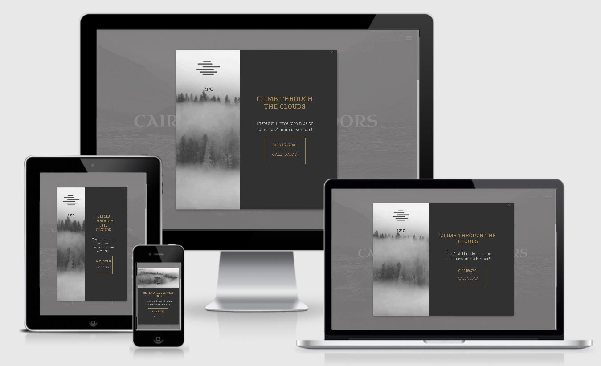
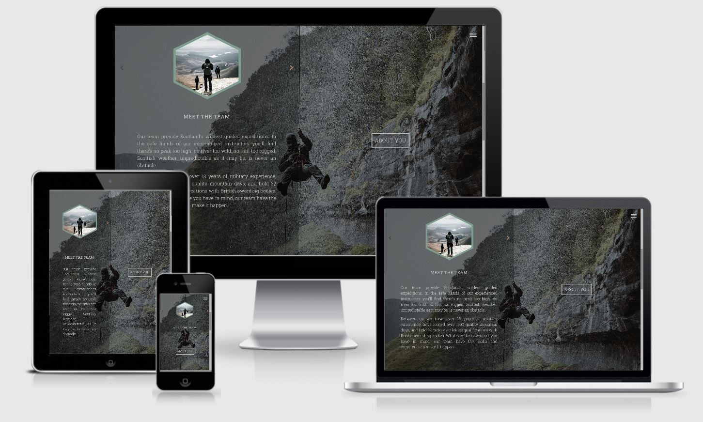
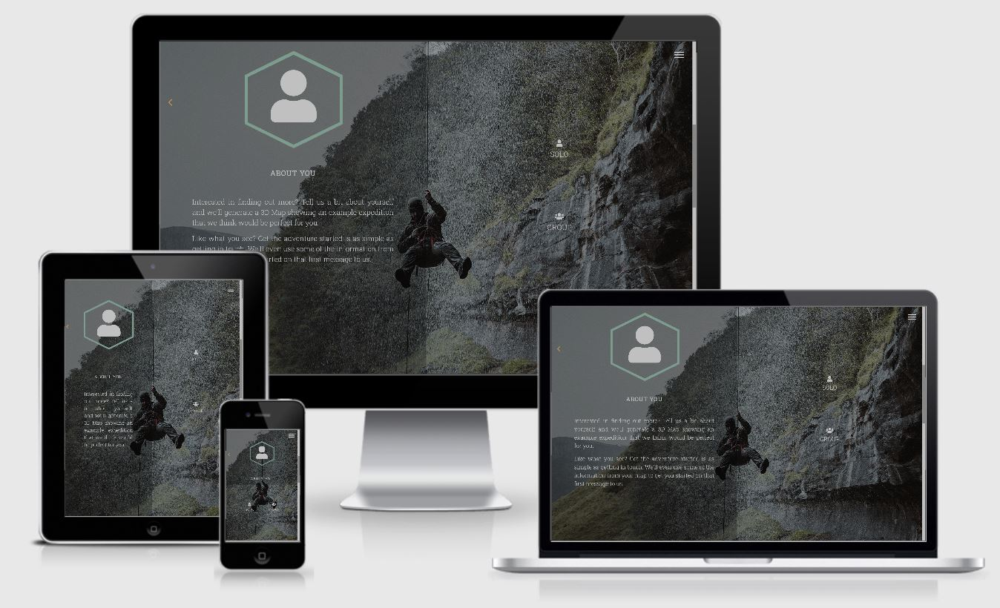

# Interactive Frontend Development Milestone Project
This project provides an interactive website for potential customers of an outdoor expedition company. User inputs to a series of questions populate a 3D map with a route, markers, photos, gifs and text with the goal of giving users an insight into what their expedition would be like. Using a little form-ception, the same user inputs are used to populate the values in a contact form, so if the user likes what they see, it's easier for them to get in touch.

## Contents
1. [UX](#ux)
    - [Users](#users)
    - [User Stories](#user-stories)
    - [Goals](#resulting-goals)
    - [Wireframes and Flowchart](#wireframes-and-flowchart)
        - [Wireframes](#wireframes)
        - [Flowchart](#flowchart)
2. [Design Choices](#design-choices)
	- [Colours](#colours)
	- [Icons](#icons)
	- [Fonts](#fonts)
3. [Features](#features)
	- [Existing Features](#existing-features)
		- [Navigation](#navigation)
		- [Home](#home)
		- [Modal](#modal)
		- [About](#about)
			- [About Us](#about-us)
			- [About You](#about-you)
		- [Map](#map)
		- [Contact](#contact)
			- [Contact: Success](#contact-success)
			- [Contact: Error](#contact-error)
		- [Footer](#footer)
	-[Future Features](#future-features)
4. [Technologies Used](#technologies-used)
	- [Tools](#tools)
	- [Libraries](#libraries)
	- [APIs](#apis)
	- [Languages](#languages)
	- [Testing](#testing)
5. [Testing](#testing)
6. [Deployment](#deployment)
7. [Credits](#credits)
	- [Code](#code)
	- [Media](#media)
	- [Acknowledgements](#acknowledgements)


## UX
### Users
Visitors to the website are likely to be potential customers. They might want to plan an expedition in the future, or they may be looking for something on very short notice. They might be an individial, or the might be part of a group of friends, or even looking for a team building exercise for a school or corporate group. 

These users will need to be able to find out a bit more about the company, see what an expedition with them would be like, and have a way to get in touch with the company. To design the website to meet these needs, the four potential user stories set out below have been followed. 

### User Stories

1. As an individiaul who loves going walking outdoors, I want to explore Scotland. I'd like to have a good idea of what the expedition will be like, especially as I'm not a fan of water. I'd like to get in touch with the company by email first, just to ask them some questions. 
2. As a high school teacher, I want to plan an end of term camping trip for our class. I want to be able to show the kids what it will be like, so they can all get really excited. The kids are all over social media, so it would be great if they could check it out before hand and post their photos there after.  
3. As a company manager in charge of booking this years team building, I want to organise something a bit different. It'd be great if I could show them what it will be like, so they know it won't be a let down like last year. 
4. As a group of friends looking for something to do tomorrow, we want to organise something straight away. We'd rather get in touch by phone than wait for an email response, so we know that it's all sorted. 

### Resulting Goals 
Based on these four user stories set out above, there are five main goals for this project: 
- Provide a way to display a potential expedition to users 
- Provide tailored options for individuals and different types of groups 
- Quickly provide the user with a telephone number for the company 
- Provide a way for users to get in touch with the company via email
- Provide links to the companies social media accounts

### Wireframes and Flowchart
##### Wireframes
These wireframes were sketched at the start of the design process: 
- [Home Section](readme-assets/pdf/home-sketch.pdf)
- [About Section](readme-assets/pdf/about-sketch.pdf)
- [Map Section](readme-assets/pdf/map-sketch.pdf)
- [Contact Section](readme-assets/pdf/contact-sketch.pdf)

Based on the preliminary sketches above, three sets of wireframes were created using [Balsamiq Wireframes](https://balsamiq.com/wireframes/). 
- [Phone](readme-assets/pdf/Phone.pdf)
- [Tablet](readme-assets/pdf/Tablet.pdf)
- [Laptop/Desktop](readme-assets/pdf/Desktop.pdf)

##### Flowchart
This flowchart visualises the path a user takes through the "About You" form questions.
- [Flowchart](readme-assets/pdf/AboutYouFlowchart.pdf)

This flowchart is useful when looking at the jquery that manipluates the user's path through the questions. 

## Design Choices
### Colours 


The colour palette consists of four colours: charcoal grey `#454545`, metallic gold `#b08d57`, metallic silver `#c0c0c0` and a metallic green `#7c9d8e`. These colours provide contrast to each other without dazzling the user with bright neon colours and they complement the colours of the images displayed across the webpage. They allow for noticable and consistent hover effects on elements across the webpage. 

### Icons 
Icons are used throughout to provide a break from text infomration, and to quickly give feedback to the user. For example, a green checkmark or a red cross quickly give feedback to the user about the success/error status of submitting their contact form. Icons have also been used in place of text where they will be automatically recognised by the user, i.e. social media icons in the footer will almost always be automatically be recognised by the user as clickable links to social media accounts. 

This project uses icons provided by [fontawesome](https://fontawesome.com/) and [ionicons](https://ionicons.com/). To keep consistency throughout the webpage, the svg files for the icons used for the custom [map markers](###markers) I have made are also from [fontawesome](https://fontawesome.com/). 

### Fonts
The company logo is formatted in Uncial Antiqua font to provide a Celtic feel upon landing on the page. 

There is a minimal amount of text content presented on the website. All of it is presented in Roboto Slab font, with different weightings and spacings applied throughout. This font was chosen because it is complimentary to Uncial Antqiua and is easy to read even on smaller screen sizes. This font has been imported using [Google Fonts](https://fonts.google.com/). 

## Features
### Existing Features 
#### Navigation


- Navigation is provided by a nav toggle icon in the top right corner. On click, this icon toggles between expanding and collapsing a navigation menu. This icon is fixed in place regardless of a users location on the webpage, providing consistency for the user. 
- On hover, items listed in the navigation menu turn gold. On click, they take the user to that section of the webpage.
- [Scrollsnap](https://css-tricks.com/practical-css-scroll-snapping/) is used to allow users to navigate through the webpage one section at a time. This also means that the user can navige through the webpage sections using keyboard controls (`up`, `down`, `enter`). 
- Using [jQuery](https://jquery.com/), the nav toggle icon changes colour to a dark charcoal colour when it is located over the map section. This provides contrast to the map colours so that it remains visible to the user. On scrolling beyond the map section, the nav toggle icon reverts to a silver colour. 

#### Home


- The user is presented with a dramatic fullscreen background image and the company logo.
- On small screens the company logo is split into two lines. On larger screens, it occupies only one line. On small screens which are rotated to a landscape view, the company logo also occupies only one line. 
- A call to action button prompts the user to "Start Your Adventure". On hover, this button turns gold. On click, this button is animated with a gold wave effect and takes the user to the next section of the page. 
- The logo, nav toggle icon and call to action button are animated to fade into visibility. The logo becomes visible first, then the nav toggle icon and call to action button. Not all [jQuery Effects](https://api.jquery.com/category/effects/) were functional on my own device, so elements have been animated with [MDBootstrap Animations](https://mdbootstrap.com/docs/jquery/css/animations/) instead. 

#### Modal


- The modal prompts the user to contact the company by phone if they want to join them on their expedition the following day. This allows users who are looking for an expedition on short notice to get in touch and organise one, without the delay of filling in a contact form and waiting for a response. 
- The modal content is determined by the current weather in the Cairngorms, retrieved from calling weather data from Aviemore from  [OpenWeather's Weather API](https://openweathermap.org/api). This live weather data is used to set a corresponding gif background image, weather icon and text for the modal.
- The weather icon is provided by [OpenWeather's Weather Icons](https://openweathermap.org/weather-conditions).  The src url for the icon is constructed by passing the weather icon code returned by the API call into a variable holding the URL template: 

    ```let weatherIconURL =  `https://openweathermap.org/img/wn/${weatherIconCode}@2x.png`;  ```
- The gifs are sourced by using the gif link from [GIPHY](https://giphy.com/). 
- [`setTimeout()`](https://www.w3schools.com/jsref/met_win_settimeout.asp) is used to delay the modal appearing until the user has been on the webpage for 15 seconds. 
- At night time, the modal still displays and provides the company contactn number to the user. The text saying "Call Today" is switched to text saying "Call Tomorrow".
- The modal maintains the same colour scheme as the rest of the site. It can be closed using the gold cross icon that appears in the top-right corner. 

### About


- This section is split into two equally sized panels. On xs-size devices, the section is split horizontally, with one panel occupying the top half of the viewport and the other the bottom half. On sm-size devices upwards, one panel occupies the right-hand half of the veiwport and the other the left-hand half. 
- The section has one large background image. Each panel has it's own background colour that is an rgba colour with a low alpha value. This makes the panel's semi-transparent so the background image can be seen. On hover, the alpha value for the panel background colour increases by 0.1, making it more opaque.
- Each panel has it's own button. On hover, the button turns gold. On click, the button displays a gold wave effect. The button then disappears to display the content of its respective panel. 

##### About Us


- On all screen sizes, this panel displays a hexagonal image with a metallic green border, with navigation chevrons on either side. Below this is a heading which corresponds to the image. 
- On the first panel, the back chevron is greyed out and cannot be clicked. On the final panel, the forwards chevron is greyed out and cannot be clicked. In between, both arrows are gold. On hover, they turn silver. 
- The navigation chevrons allow the user to move forwards and backwards through photographs and their corresponding headings. 
- The first five images show photographs relating to company's team. I created these images using [Vectr](https://vectr.com/). 
- The sixth image contains [fontawesome's single user icon](https://fontawesome.com/icons/user) and was created by downloading the icon svg file from fontawesome. If the user's answer to the first "About You" form question indicates they are part of a group, this image changes to [fontawesome's group icon](https://fontawesome.com/icons/users). I also created these using [Vectr](https://vectr.com/). 
- Once the user enteres a name for themselves or their group in the "About You" form, the heading below this user/users image changes to the value inputted for their name. 
- On small screened devices and above, a paragraph if displayed below the heading with related text. These paragraphs also change with the image and headings on navigating via the navigation chevrons. On large devices, this increases to two paragraphs. All paragraphs are hidden on devices with extra-small screens. 
- The final panel prompts the user to enter some information about themselves. After a 3 second delay, the "About You" button is animates to call attention to it. 

##### About You


- This panel contains a series of questions about the user to determine which expedition to load onto the 3D map. The first panel allows user to select between a solo or group expedition, and this determines the series of questions displayed to them. The flowchart for these questions can be seen [here](#flowchart).
- User responses on previous panels are used to set personalised prompts on the following panels. They are also used to set html content in the panel and the values of the contact form.
- A back icon allows the user to revisit questions they have previously answered, and alter their input. On hover, this icon and its accompanying text turn gold. On click, this takes the user backwards to the previous question they have answered. This button is hidden on the first panel. I have used [jQuery](https://jquery.com/) to control the visibility of these questions so that when a user clicks the previous button, it reverses back through the path the user has taken through the questions, and does not show questions which were not previously displayed to them.
- On completion of the form, a button is displayed which takes the user to the 3D map. This button is silver, and on hover turns gold. On click, this button has a gold wave effect. Also on click, this button takes the values the user has inputted into the form and passes them as the parameters for the `loadMap(mapClientType, mapGroupType, mapDays, mapWater)` function. The result is that the user's screen scrolls down to a 3D map that is loaded with an expedition tailored to the values they have provided. 

#### Map


- Fullscreen 3D map created using [ArcGIS JavaScrip API](https://developers.arcgis.com/javascript/).
- On [`$(document).ready()`](https://learn.jquery.com/using-jquery-core/document-ready/), the map loads centered on the Caringorm's National Park with a marker displaying the location of the company HQ building. This marker has a y-offset so that the map marker appears to float in the air above the ground. 
- On click, this marker opens a popup with the HQ address and a photograph of the building. 
- All popup's have a cross icon to close them, and a zoom icon to zoom in on the corresponding location. 
- Once the user has completed the "About You" form, the parameters it passes to the `loadMap(mapClientType, mapGroupType, mapDays, mapWater)` function are used to test a series of conditional statements which determine which graphics are added to graphics layer of the map. These conditional statements can be found on lines `113-154` of the [arcGIS.js file](assests/js/arcGIS.js) in this repository.  The result is that the when the map reloads, it is populated with a route and corresponding markers that match the users responses to the "About You" form.


- I designed the markers to load on to the map using [Vectr](https://vectr.com/). The icons in the markers were downloaded from [fontawesome](https://fontawesome.com/) and made transparent. Their colours contrast well with the map's basemap colours and their hexagonal shape gives them substance above the map and matches the hexagonal images used in the About Us panel. 
- All markers on the map are clickable, and open up a popup on click. A neon blue glow around the icon indicates that it has been clicked. The popup contains either a photograph or a gif, and some text related to the marked point. The gifs were downloaded from [GIPHY](https://giphy.com/) and cropped into squares using [Ezgif](https://ezgif.com/crop).
- To make populating the map with these graphics a bit neater, I created two object types, `ConstructMarker` and `ConstructPolyline` which allowed me to store the values for each marker (geocoordinates, marker image, marker size, and popup contents) and line (colour and geocoordinates) as objects. I also created two functions, `addMarker(markerObject)` and `addPolyline(polylineObject)` which take the constructed objects as parameters and add them to the map's graphics layer when the function is executed. These can be found on lines `37-109` of the [arcGIS.js file](assests/js/arcGIS.js) in this repository. 
- Water journeys are added onto the map as a blue polyline, while land journeys are added onto the map as a dark orange polyline. 
- This map can be navigated using finger gestures on a touchscreen or by mouse/keyboard on a non-touch device. On both devices, inbuilt navigation widgets are displayed allowing a user to control magnification, map position and aerial zoom, as well as reorient the map.
- On touchscreen devices, a transparent column on the right-hand side, with a charcoal grey scroll icon at the bottom aids scrolling past the map. This was added in response to testing the webpage on a mobile device (see the [testing.md file](testing.md) in this repository). To load this column in Google Developer Tools, the page must be reloaded once the touchscreen device has been selected.

#### Contact


- The user is presented with a contact form with an input area for their name, phone number, email address and a message. Each input and text area have a silver border. On hover, the input and textarea borders turn gold. Behind the contact form, the section has a fullscreen background. The contact form overlays this with a semi-transparent background of its own, aiding visibilty of the contact form text.
-On xs-screen devices, this contact form fills the viewport. On small devices and larger, it fills 50% of the viewport width. 
- If the user has filled out the "About You" form, the contact form will be populated with corresponding values dependent to the user's responses for the the ["About You" form](#about-you). These include individual name, group name, group size, preferred duration and if they would like to inlcude a water journey.
- Below the textarea is a submit button. On hover, the submit button turns gold. On click, the form will not submit unless all input areas have a value inputted. For the email address, this value must be in an email format (i.e. john.smith@email.co.uk).
- The contact form is connected to [EmailJS](https://www.emailjs.com/) which in turn is connected to my personal email address. On submit, this sends an email with the user's name, contact details and message, to my email address. Below is a copy of a test email: 


- On submitting the form, the user is presented with a feedback message to let them know if it has sent succesfully or if there has been an error. A success or error message is also logged to the console. The [jQuery](https://jquery.com/) for this can be found in the [email.js file](assets/js/email.js) in this repository. 

##### Contact: Success


- On successful submission of the contact form, a success message is logged to the console. 
- The green checkmark icon immediately feeds back to user that the form has sent successfully. 
- Text below the "Success" header thanks the user for their message and prompts the user to view the companies social media accounts.
- The words "social media" are coloured gold to draw the user's attention to them and highlight that they are a link. On hover, they turn silver. On click, if social media icons in the footer are not already in the viewport, the screen scrolls to them. 
- As well as scrolling to the social media icons, on clicking the social media link text, a heartBeat animation is added to the social media icons to draw the user's attention to them. A delay is added to this animation to allow time for the smoothscroll to have executed. 

##### Contact: Error 


- On failed submission of the contact form, an error message is logged to the console. 
- The red cross icon immediately feeds back to user that there has been an error in sending the form. 
- Text below the "Error" header let's the user know that the company does want to hear from them, and provides the user with two alternative ways to contact the company: by phone or by email. 

#### Footer


- The footer occupies the full viewport width. On xs-sized screens, the footer splits into two rows. On sm-sized screens and above, it is displayed as one row.
- The footer has a charcoal background colour to contrast against the green contact form background image. The text and icons contained in the footer are coloured silver and stand out against the charcoal colour of the footer. 
- On small-sized screens and above, the footer is visible on the contact section. On xs-screens, this is pushed below the contact form section. 
- An up arrow icon accompanied with the text "scroll to top" allow the user to go back to the top of the webpage. On hover, the arrow icon turns gold. On click, the webpage scrolls back to the home section. This is animated with a smooth scroll effect. 
- Four social icons provide links to socail media websites. On hover, these icons turn gold.  On click, these icons open their respective social media sites in a new tab. These are currently linked to the landing page of the corresponding social media company.

### Future Features 
There are a couple of features that I would still like to implement in the future: 
1. Implementing the ability for a user to sketch their own route and add their own markers to the 3D Map. ArcGIS provide a [Sketch Widget](https://developers.arcgis.com/javascript/latest/sample-code/sketch-geometries/index.html) for users to "sketch" their own route on a map and combining this with the ArcGIS [SceneViewScreenshot](https://developers.arcgis.com/javascript/latest/sample-code/sceneview-screenshot/index.html) would allow a user to submit their sketched route with the contact form. If I can automate this for the user, even better.

2. Implementing the ability for a user to load different expeditions without changing their responses to the "About You" questions. Currently, each permutation of the values the `loadMap(mapClientType, mapGroupType, mapDays, mapWater)` function takes as parameters produce the same map each time. By adding more polyline objects and corresponding markers, and randomising the selection of them, will mean a different map can be generated from the same responses. This would add an extra element of interactivity for the user. 

## Technologies Used 
### Tools 
- [GitHub](https://github.com/) and [Gitpod](https://www.gitpod.io/) to host, develop and deploy the webpage.
- [EZgif](https://ezgif.com/) to crop the gifs used in the map popups into squares. 
- [AmIResponsive](http://ami.responsivedesign.is/) to create the screenshots used in this readme. 
- [Vectr](https://vectr.com/) to create the company logo, "about us" photos and map markers. 
- [Balsamiq](https://balsamiq.com/) to create the digial wireframes. 
- [Sharpie](https://www.sharpie.com/) to create the original hand-sketched wireframes.

### Libraries
- [jQuery](https://jquery.com) to make the wesbite elements interactive and provide DOM manipulation 
- [Bootstrap](https://getbootstrap.com/) to create the responsive structure of the website and enable flex behaviours. 
- [MDBootstrap](https://mdbootstrap.com/docs/jquery/css/animations/) to animate elements on the webpage with jQuery. 
- [FontAwesome](https://fontawesome.com/) and [IonIcons](https://ionicons.com/) to provide icons. 
- [Google Fonts](https://fonts.google.com/) to provide the Roboto Slab font and font weights. 

### APIs 
- [OpenWeather API](https://openweathermap.org/api) to provide live weather data for the modal.
- [ArcGIS JavaScript API](https://developers.arcgis.com/javascript/) to provide the 3D map.
- [EmailJS](https://www.emailjs.com/) web server to send user's contact form response to my email address.

### Languages 
- HTML to create the website.
- CSS to style the website elements.
- Javascript to work with the ArcGIS JavaScript API.

### Testing 
- For technologies used for testing see [testing.md](testing.md).

## Testing 
For information about the testing of this webpage, see the separate [testing.md](testing.md) file


## Deployment
This site was developed as GitHub repository using GitPod. It will be deployed to GitHub Pages and can be viewed [here](https://mvmolloy.github.io/milestone-project-2/).  

The development version and deployed versions are identitcal and the master branch is the only branch. 

The GitHub repository is located at [here](https://github.com/mvmolloy/milestone-project-2). 

To save a copy of this repository locally, click on the "Clone or download" button at the top of the repository page. Click "Download ZIP" and save the file. 

To fork the github repository, click the "fork" button at the top of the repository page. 

To clone the github repository using HTTPS, in Git Bash go to the working directory that you want to clone the repository to and type: ```git clone https://github.com/mvmolloy/milestone-project-2```

Press `enter` to create the local clone. 

## Credits 

### Content
- All text content has been written by myself. 

### Code
- The CSS for the Scrollbar Webkit came from [CSS-tricks](https://css-tricks.com/custom-scrollbars-in-webkit/).
- The method of setting a minimum font-size came from an answer to this [Stackoverflow Question](https://stackoverflow.com/questions/23984629/how-to-set-min-font-size-in-css).
- The jQuery to check if a device is touchscreen or not came from an answer to this [Stackoverflow Question](https://stackoverflow.com/questions/4817029/whats-the-best-way-to-detect-a-touch-screen-device-using-javascript). 

### Media
- The photographs for the home, about and contact section backgrounds were taken by [Niklas Soderlund](https://niklassoderlund.com/). 
- All other photographs used have come from myself, or friends have allowed me to use for the project. 
- All the gifs used come from [GIPHY](https://giphy.com/). 

### Acknowledgements 
- I learned how to work with ArcGIS using the [ArcGIS for Developers Tutorials](https://developers.arcgis.com/javascript/latest/guide/create-a-starter-app/). 

--- 

This project was created as a project for submission to the [Code Institute](https://codeinstitute.net/) and is for educational use only. 
