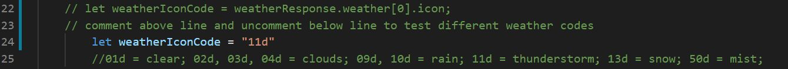

# Testing Details for Interactive Frontend Development Project

The readme file for this project can be found [here](README.md).

The respository for this project can be found [here](https://github.com/mvmolloy/milestone-project-2). 

The deployed version of this project can be found [here](https://mvmolloy.github.io/milestone-project-2/)

## Contents 
1. [Automated Testing](#automated-testing)
    - [Code Validation](#code-validation)
         - [HTML](#html)
         - [CSS](#css) 
         - [JavaScript](#Javascript)
2. [User Stories Testing](#user-stories-testing) 
    - [Story One](#story-one)
    - [Story Two](#story-two)
    - [Story Three](#story-three)
    - [Story Four](#story-four)
3. [Manual Testing](#manual-testing)
    - [Navigation](#navigaton)
         - [Navigation: Mobile](#navigation-mobile)
         - [Navigation: Tablet](#navigaton-tablet)
         - [Navigation: Desktop](#navigation-desktop)
    - [Home](#home)
        - [Home: Mobile](#home-mobile)
        - [Home: Tablet](#home-tablet)
        - [Home: Desktop](#home-desktop)
    - [Modal](#modal)
        - [Modal: Mobile](#modal-mobile)
        - [Modal: Tablet](#modal-tablet)
        - [Modal: Desktop](#modal-desktop)
    - [About](#about)
         - [About: Mobile](#about-mobile)
         - [About: Tablet](#about-tablet)
         - [About: Desktop](#about-desktop)
    - [Map](#map)
         - [Map: Mobile](#map-mobile)
         - [Map: Tablet](#map-tablet)
         - [Map: Desktop](#map-desktop)
    - [Contact](#contact)
         - [Contact: Mobile](#contact-mobile)
         - [Contact: Tablet](#contact-tablet)
         - [Contact: Desktop](#contact-desktop)
    - [Footer](#footer)
         - [Footer: Mobile](#footer-mobile)
         - [Footer: Tablet](#footer-tablet)
         - [Footer: Desktop](#footer-desktop)
3. [Bugs Fixed](#bugs-fixed)
4. [Bugs Unfixed](#bugs-unfixed)

## Automated Testing
### Code Validation 
#### HTML
HTML Validation has been carried out on [index.html](index.html) using the [W3C Markup Validation Service](https://validator.w3.org/). 

Initial validation retured a mix of 14 errors and warnings. 

#### Button Nested inside anchor tag


The button was nested inside an anchor tag to link to the "About" section on click. I have removed the anchor tags and added jQuery to [script.js](assets/js/script.js) to provide the link functionality: 

```
$("#header-cta-btn").click(function(){
         window.location.href="#about";
    });
```
This button still functions as a link on click and the validation error has been resolved. 


### Display Property applied to line break tag


The `d-sm-none` class was applied to the `<br>` tag in the footer to only apply the line break below the sm breakpoint. 
I have nested the `<br>` tag in a span tags and applied the display class to the span instead. 

This line break still functions below the sm breakpoint and the validation error has been resolved. 

### Paragraph element nested in span


The span tags in the modal allowed a border to be added around the call-to-action text. I have nested this content inside div tags instead. 

The border still displays correctly aroudn the content and does not affect the display of the remaining modal content. This has removed the validation error. 

### Type attribute not allowed on textaarea element


I have removed the type attribute from the textarea in the contact form. This has removed the validation error

### Aria-labelledby attribute not an element within document


I had not edited the example aria-labelledby attribute from the Bootstrap Modal code. I replaced this attribute with my modal label, "weatherModal". This has fixed the validation error. 


### Modal heading is empty 


These `<h2>` tags were empty as the heading HTML is set by jQuery on repsonse from the openWeather API in the [weather.js](assets/js/weather.js) file. I have added placeholder text to the `<h2>` element. On testing the modal, the placeholder text is never seen by the user and this has fixed the validation warning. 

### Type attribute uneccesary for JavaScript Resources 


I have removed the type attribute from the `<script>` links at the end of the HTML body in the [index.html](index.html) file. The links still to the local [JavaScript files](assets/js) still function and this has fixed the validation warning. 

### Remaining Warning: Sections exist without headers 


The map and contact sections do not have headings. The map section does not have any text content at all. I have left this warning. 

### All HTML Errors Resolved


Validation on the HTML in [index.html](index.html) now returns no errors. 

## CSS
CSS Validation has been carried out on [style.css](assets/css/style.css) using the [W3C CSS Validation Service](https://jigsaw.w3.org/css-validator/). 

Intital validation returned 3 errors and 5 warnings. 

### Parsing Errors


Three parsing errors were found in the [style.css](assets/css/style.css) file. 

The first error was left-over from moving the style from an inline style to the `.label-water` css class. This has been fixed by removing the `;"` that appeared before the closing brace. 

The second and third errors have been solved by adding a space between the `-` symbol and the font-size. 

All three parsing errors have now been resolved. 

### CSS Warnings 


#### break-word deprecated
The `word-break: break-word` style was applied because the email address in the contact form error message would overflow its container/screen on small screens. After checking the [MDN Documentation](https://developer.mozilla.org/en-US/docs/Web/CSS/word-break), I have resolved the warning about the deprecated `word-break: break-word` value by changing this value to 
```
word-break: normal;
overflow-wrap: break-word;
``` 

I have checked that when the contact form error message is displayed, this still correctly breaks the email address rather than allowing 
the overflow. It works correctly and the validation warning has now been resolved. 

#### Webkit warning 
The scrollbar webkit allows custom styling of the scrollbar. After checking the [MDN Documentation](https://developer.mozilla.org/en-US/docs/Web/CSS/::-webkit-scrollbar) the webkit scrollbar is a non-standard feature, so will return a warning. 

I have tested it across multiple devices and it works well. The scrollbar webkit has been left in the CSS and so the warning remains upon validation. 

### All CSS Errors resolved 


Validation on the CSS in [style.css](assets/css/style.css) now returns no errors. 

### JavaScript 
JavaScript Validation has been carried out on [script.js](assets/js/script.js), [weather.js](assets/js/weather.js), [arcGIS.js](assets/js/arcGIS.js) and [email.js](assets/js/email.js) using the [JSHint](https://jshint.com/).

#### script.js 
Validation on [script.js](assets/js/script.js) highlighted 16 missing semicolons. As a result, 16 missing semicolons have been inserted.

#### weather.js 
Validation on [weather.js](assets/js/weather.js) highlighted 4 missing semicolons. As a result, 4 semicolons have been inserted. 

#### arcGIS.js 
Validation on [arcGIS.js](assets/js/arcGIS.js) highlighted 16 missing semicolons and 5 unecessary semicolons have been removed.

The conditional logic statements used to add markers to the map do not return an error but they do have a high cyclomatic complexity number of 17 and contains a total of 74 statements. I know this needs refactoring but this is a lower priority than some of the other ammendments that need to be made so is currently left as an unfixed bug. 

#### email.js 
Validation on [email.js](assets/js/email.js) highlighted 1 unecessary semicolon which has been removed.

#### Undefined and Unused Variables 
Validation on all files returned errors regarding undefined and unused variables. This occurs as files and functions created in other files, or generated by user input. The undefined variables and undefined variables are removed when the files are concatenated and run through JSHint. 

When running JSHint, the errors undefined variable and unused variable appear when one file either creates or uses a function that is utilized or created in another file. As validates one JS file at a time, it is not aware of the other files.

## User Stories Testing
Manual testing has been conducted on the [deployed webpage](https://mvmolloy.github.io/milestone-project-2) by following through the user stories set out in UX section of the [readme.md](readme.md) file. 

### Story One
**A reminder of Story Two:** As an individual who loves going walking outdoors, I want to explore Scotland. I'd like to have a good idea of what the expedition will be like, especially as I'm not a fan of water. I'd like to get in touch with the company by email first, just to ask them some questions.

- The user can learn about the company and the type of expeditions they offer in the "About Us" Section. 
- The user can filter the type of expedition they would like in the "About You" Section
    - If the user does not want to include a water journey in their expedition, they can click the cross icon on the question "Would you like your expedition to include a water journey?"
- The user can get a feel for what their expedition would be like by viewing and interacting with a corresponding expedition on the 3D map. 
- The user can get in touch with the company by email using the the contact form. The user will recieve a success or error response message as feedback. 
    - If there are any errors in sending the email, the error message displays the company's email address so they can still get in touch by email. 

    
### Story Two
**A reminder of Story Two:** As a high school teacher, I want to plan an end of term camping trip for our class. I want to be able to show the kids what it will be like, so they can all get really excited. The kids are all over social media, so it would be great if they could check it out before hand and post their photos there after.

- The user can learn about the company and the type of expeditions they offer in the "About Us" Section. 
- The user can filter the type of expedition they would like in the "About You" Section
    - The user can select that they are a group, and then filter this selection by indicating they are a school group. 
- The user can get a feel for what their expedition would be like by viewing and interacting with a corresponding expedition on the 3D map. 
- The user can get in touch with the company by email using the the contact form. The user will recieve a success or error response message as feedback. 
    - If there are any errors in sending the email, alternative methods of contacting the company are provided. 
- The company's social media links are provided in the footer. When the user clicks on these links, they open in a new tab.
    - These links can be shared with the teacher's students. 

### Story Three
**A reminder of Story Three:** As a company manager in charge of booking this years team building, I want to organise something a bit different. It'd be great if I could show them what it will be like, so they know it won't be a let down like last year.

- The dramatic image that the user is presented with upon landing on the site demonstrates that an expedition with the company won't be a run-of-the-mill team-building exerise. 
- The user can filter the type of expedition they would like in the "About You" Section
    - The user can select that they are a group, and then filter this selection by indicating they are a corporate group. 
- The user can get a feel for what their expedition would be like by viewing and interacting with a corresponding expedition on the 3D map. 
    - The user can show this map to their team. 
- The user can get in touch with the company by email using the the contact form. The user will recieve a success or error response message as feedback. 
    - If there are any errors in sending the email, alternative methods of contacting the company are provided. 
- The company's social media links are provided in the footer. When the user clicks on these links, they open in a new tab.
    - These links can be shared with their team. 

### Story Four
**A reminder of Story Four:** As a group of friends looking for something to do tomorrow, we want to organise something straight away. We'd rather get in touch by phone than wait for an email response, so we know that it's all sorted.

- After being on the webpage for 15 seconds, a modal appears regardless of where the user is on the webpage. This modal prompts the user to join the company on their expedition the following day, whatever the weather. 
- The modal provides the user with the company's telephone number, so that they can call them rather than use the contact form. 
- If it is night time, the modal informs the user that the office is closed. The phone number is still provided, and the user is prompted to call the company tomorrow. 


## Manual Testing
For the manual testing of the webpage, I have tested each section on three different physical devices - a mobile device (Huawei P10), a tablet device (Lenovo Tab E10), and a desktop device (HP Pavilion 14). I have also rerun this testing using the [AmIResponsive](http://ami.responsivedesign.is/) tool and [InfoByIP's Website Resolution Checker](http://www.infobyip.com/testwebsiteresolution.php?) to test the wesbite for a screen with high resolution as my largest computer screen is 14".

### Navigation
#### Navigation: Mobile
- On page loading, after the delay of 3 seconds the nav toggle icon appears in the top right corner of the screen. 
    - On clicking the nav toggle icon, the icon turns gold and the nav menu expands. 
    - The links in the nav menu are silver. On click, the link turns gold and the page scrolls to that section with a smooth scroll effect. 
        - All the links scroll to the correct page section. 
        - The nav toggle icon stays in the same position on all sections. 
    - On clicking the nav toggle icon agian, the nav menu collapses and the icon turns silver again.
    - Over the map section, the nav icon turns to a charcoal grey colour. On click, the nav menu expands as usual and the nav icon turns gold. On click again, it reverts to the charcoal colour. 
    
#### Navigation: Tablet
#### Navigation: Desktop

### Home
#### Home: Mobile
- The background image displays as a full screen image. The background image is centered. 
- The company logo is displayed as a the split logo occupying two lines. 
- The company logo does not load with the expected delay. 
    - On investigation, I have found this is because I deleted the delay class form the image. I have added this back and the animation now works and the logo loads after pageload with a delay of one second. 
- The call to action button loads after a delay. On click, the button and text turn gold and the gold wave effect can be breifly seen before the page scrolls to the About section. 

#### Home: Tablet
#### Home: Desktop

### Modal
I have tested the jQuery that sets the correct content to the modal using inline testing in the [weather.js](assets/js/weather.js) file. I have commented out this test and left it in the file, on lines `23-25`. To test the modal yourself, comment out line `22` and uncomment line `24`. Use the weather codes in line `25` to test the different weather codes. It should look like: 




#### Modal: Mobile
- The modal opens 15s seconds after the page loads. The modal background freezes out the rest of the screen. 
- The gif shows that it is currently cloudy and 13 degrees in the Cairngorms. The gif occupies the top section of the modal. 
- The header content is "Climb through the Clouds" and the text prompting me to call the company says "Call Today". 
    - All the text is large enough to read comfortably and the colours contrast well.
- A gold cross in the top right-hand corner of the modal closes the modal on click. 

#### Modal: Tablet
#### Modal: Desktop 

### About
#### About: Mobile
- The About section background occupies the whole screen and is centered. 
- The About Us panel displays on the top half of the screen. The About You panel displays on the bottom half of the screen. 
- Each section has a button centered in the middle. 
#### About Us
- On clicking the "About Us" button, the About Us Panel's opacity increases and the Meet The Team photo and header appear. 
- The two navigation chevrons appear on either side of the photo. The back chevron is greyed out. 
    - On clicking the back chevron, nothing happens. 
    - On clicking the next chevron, the next team photo and header appear.
        - On clicking the next chevron, the back chevron turns gold. On clicking the back chevron again, the first photo and header are displayed again. However, the back chevron then disappears rather than becoming greyed out again. On investigation, this is because the `.vis-none` class is applied to the chevrons in the [script.js](assets/js/script.js) file on lines `65` and `67`. I have fixed this by changing the `.vis-none` classes in to the `.about-nav-btn-inactive` class. 
 - The navigation chevrons navigate correctly through all the photos and headers. 
 - On the final photo, the forwards chevron is greyed out. On clicking the chevron, nothing happens. 
 - The final photo displays the user icon and the header "About You". 
 - After a delay, the About You button below the panel is animated to draw attention to it. 
    - If the group option is selected in the "About You" section, the image changes from the single user icon to the group users icon. 
    - When a name is entered in the "About You" section, the footer header changes to the name's value. 
#### About You 
 - On clicking the "About You" button, the button disappears and the icons and text labels for the "Solo" or "Group" options appear. They are side-by-side and centered on the screen. 
##### Solo: 
- On clicking the solo option, a text box appears with the header "Enter Your Name", a text box with a silver border.
- A back arrow and the text "previous" appear in the bottom left-hand corner. 
##### Group: 
- On clicking the group option, three icons and text labels appear for the options friends, school, or corporate group type. 
- A back arrow and the text "previous" appear in the bottom left-hand corner. 
#### Group Type: 
On clicking any of the group type labels, they disappear and the a text box appears with the header "Enter Your Name", a text box with a silver border.
- A back arrow and the text "previous" appear in the bottom left-hand corner. 
#### Name: 
- If the **solo** option was selected, the header above the text box says "Enter Your Name:". 
    - On entering my name, Megan, a next button appears. On clicking the next button, these elements disppear. A new header appears saying "Hi, Megan! How many days woud you like your expedition to last."
- If the **group** option was seclected, and then **friends** grouptype option selected, the header above the text box says "Enter a Name for your Group:". 
    - On entering a group name of "The Three Musketeers", a next button appears. On clicking the next button, these elements disappear. A new header appears saying "How many people are in your group?" and three options for group-size are displayed. 
- If the **group** option was seclected, and then **school** grouptype option selected, the header above the text box says "Enter the Name of your School:".
    - On entering a group name of "Test High School", a next button appears. On clicking the next button, these elements disappear. A new header appears saying "How many people are in your group from Test High School?" and three options for group-size are displayed. 
- If the **group** option was seclected, and then **corporate** grouptype option selected, the header above the text box says "Enter the Name of your Business:".
    - On entering a group name of "Test Business", a next button appears. On clicking the next button, these elements disappear. A new header appears saying "How many people are in your group from Test Business?" and three options for group-size are displayed. 
- The next button is not displayed until a value is entered into the name text box. However, if the value entered in the name box is then deleted and the next button is clicked, the panel is still displayed. 
    - On investigation, this is because the jQuery that controls the form behaviour on clicking the next button under the name input box shares the function which controls the form behaviour on clicking any of the labels. I have fixed this by separating these. The behaviour of the next button is now controlled by jQuery starting on line `90` of the [script.js](assets/js/script.js) file. It allows the user to move on only after first checking to see that a value is entered, and that if a value is entered, it is not just white space.: ```if(clientName.value.trim().length > 0) {...} ```. This bug is now resolved. 
 
 #### Water Journey: 
- After fixing the error with the name string, the rest of the contact form works as expected.
- The final question asks if you would like to include a water journey. Two icons appear, a cross and a checkmark. On selecting an option, the water question disappears and the final panel is displayed. 

#### Go to 3D Map
- A silver button is displayed in the centre of the panel with a map icon, and the text "3D Map"
- When the **solo** option was selected, and I entered my name, Megan, the text below the button says "Megan, we've generated a 3D Expedition for you based on your responses. 
- When the **group** option was selected, and then the **friends** group type was selected, the text below the button says "We've generated a 3D expedition for your group based on your responses". 
- When the **group** option was selected, and then the **school** group type was selected, and I entered "Test High School" as the school name, the text below the button says "We've generated a 3D expedition for your group from Test High School based on your responses". 
- When the **group** option was selected, and then the **corporate** group type was selected, and I entered "Test Business" as the school name, the text below the button says "We've generated a 3D expedition for your group from Test Business based on your responses". 
- On clicking the button, the page scrolls down to the map section with a smoothscroll effect. 

#### About: Tablet
#### About: Desktop

### Map
#### Map: Mobile
- A fullscreen map is displayed. The navigation controls appear in the top left-hand corner. The site navigation icon is in the top right-hand corner. The basemap toggle widget is in the bottom left-hand corner. 
- The map is explorable using the navigation controls or fingure gestures. 
- The scroll icon appears in the bottom right-hand corner and the scrollable column on the right-hand side is functioning. 
    - This icon/column can be loaded in Chrome Developer tools but this must be set to a touch-screen device and the page refreshed before this is visible. 
- A route corresponding to my most recent set of values inputted into the "About You" form is displayed. 
    - Changing these answers changes the markers and route displayed on the map accordingly
    - Changing a response to the water question from "yes" to "no" removes the water route and related markers and subsitutes it with a land route.
    - Changing from **solo** to **group** and between group types changes the markers and marker popup content loaded on to the map. 
- The custom markers are displaying correctly. However, it seems that you have to click at the bottom of the marker or slightly below it to open the popup. I have tried to fix this by adding a y-offset the point marked by the marker, and not just the marker itself, but this has not solved it and unfortunately this bug remains unresolved. 
 - On clicking the markers, the photos/gifs are no longer displaying. On inspection, this is because the URLs provided as the src attribute for the photos have changed since the site has been deployed.
        - This has now been fixed by providing the new URLs and the photos/gifs are displaying in the popups. The esri popups used by the ArcGIS map cannot take a local file location as a source, which is why the URLs have been used. 
        
#### Map: Tablet
#### Map: Desktop

### Contact
#### Contact: Mobile
#### Contact: Tablet
#### Contact: Desktop

### Footer
#### Footer: Mobile
#### Footer: Tablet
#### Footer: Desktop 


## Bugs Fixed
- Nested button [removed from anchor tags](#button-nested-inside-anchor-tag) and given onClick jQuery instead. 
- Nested `<br>` tag insite span tags and [applied the display class to the span](#display-property-applied-to-line-break-tag) instead
- Nested the modal call to action content [inside a div instead of a span](#paragraph-element-nested-in-span)
- [Removed the type attribute](#type-attribute-not-allowed-on-textarea-element) from the textarea.  
- [Corrected Aria-labelledby attribute](#aria-labelledby-attribute-not-an-element-within-document) to target the modal
- [Added placeholder text](#modal-heading-is-empty) to the header in the modal. 
- [Removed type attribute](#type-attribute-uneccesary-for-javascript-resources) on script links at the end of [index.html](index.html) body. 
- Fixing [parsing errors](#parsing-errors) in the the [style.css](assets/css/style.css) file. 
- Switching the deprecated [`word-break: break-word` to `word-break: normal`](#css-warnings). 
- [Missing semicolons added and unnecessary semicolons removed](#javascript) from JavaScript files.
- Re-added [animation delay class to company logo](#home-mobile) on the home section. 
- Corrected the [visibility of the "About Us" navigation chevrons](#about-mobile).
- Preventing a user from being able to [submit an empty string as a name value](#about-mobile) in the "About You" form. 
- Fixed the URL's for the src attributes for the [map popup images and gifs](#map: mobile). 


## Bugs Unfixed 
- The conditional logic statements in the [arcGIS.js](assets/js/arcGIS.js) file the work sufficiently and return no errors. However, their high cyclomatic complexity number of 17 remains high. This bug will be fixed by refactoring the statements. 
- On some devices, the user has to click towards the bottom of a marker icon on the map to open the popup. I will need to learn more about the esri Marker/popups used by ArcGis to be able to solve this. 
